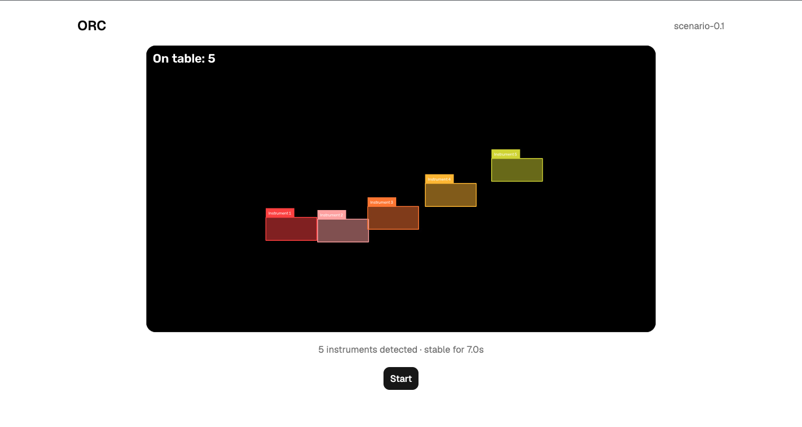
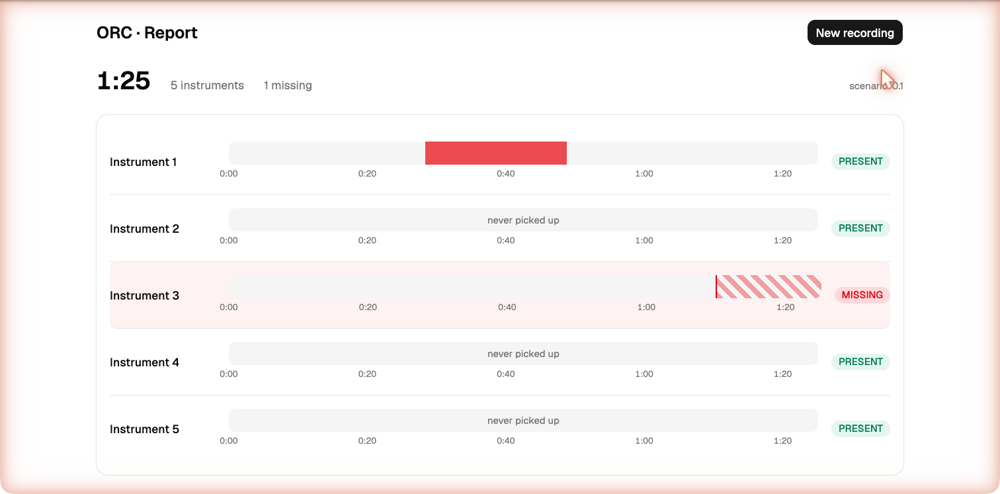

# ORC Demo App — Frontend Screens & Functionality

What each screen of the `app/frontend` demo UI needs to do, and what every button does. Screenshots are the **current build**, captured live against the `--fake` backend.

The whole app is **3 screens** and **3 buttons** (Start, Stop, New recording). One operator, one screen, one recording at a time.

---

## Screen 1 — Setup

**Purpose:** let the operator confirm every instrument is detected on the table, then start recording.

**Functionality:**
- Show the **live camera feed** with the detection overlay (a coloured box per detected instrument).
- Show **how many instruments are detected** and **how long that set has been stable** (e.g. "5 instruments detected · stable for 18.0s").
- Show a **health warning** if the camera freezes or the backend connection drops.

**Buttons:**
- **Start** — begins the recording. Disabled until it's safe to start: camera OK, **and** at least 1 instrument detected, **and** the detected set unchanged for **≥ 2 seconds**. While disabled it says *why* (e.g. "waiting for stable detections…"). Enabling it is the operator's judgment call that the overlay looks right.

---

## Screen 2 — Recording

_The previous recording-screen capture was removed from this page because it
showed analytics that are now report-only. Refresh this screenshot after the
next visual documentation pass._

**Purpose:** monitor the instruments live while the procedure runs.

**Functionality:**
- Show the **live feed** with overlay.
- Show a **running timer** (time since Start).
- Show a **per-instrument list**, one row each:
  - instrument **name**,
  - an **ON TABLE / OFF TABLE** state.

Usage timing, pickup history, and Completeness are not shown live. They appear
only on the Report after Stop.

**Buttons:**
- **Stop** — ends the recording and jumps to the Report. Always enabled while recording.

---

## Screen 3 — Report

**Purpose:** show what happened, per instrument. This is the demo payoff.

**Functionality:**
- **Headline numbers:** total duration, number of instruments, and how many are **missing**.
- One **row per instrument** with:
  - **Usage timeline** — when it was off the table, drawn as bars on a time axis. A solid bar = picked up and returned; a hatched bar running to the end = left and never came back; "never picked up" = untouched.
  - **Completeness** — **PRESENT** (green) or **MISSING** (red). Missing rows are tinted so they stand out.

> The word is **"missing", not "lost"** — the camera can only see that an instrument is not back on the table, not whether it's misplaced or truly lost.

**Buttons:**
- **New recording** — returns to the Setup screen to start another run. It does *not* record immediately; the real Start is the gated button back on Setup, and the previous report stays reachable until you actually press Start again.

---

## On every screen

- **Header** — the app title ("ORC") and the model version (e.g. `scenario-0.1`).
- **Health banner** — appears only when the camera stalled or the backend is unreachable; hidden when everything is fine.

---

## All buttons at a glance

| Button | Screen | What it does |
|---|---|---|
| **Start** | Setup | Begins recording. Gated: enabled only when the camera is OK and the detected set is stable for ≥ 2 s. Says why when disabled. |
| **Stop** | Recording | Ends recording, computes the report, and shows the Report screen. Always enabled while recording. |
| **New recording** | Report | Goes back to Setup for another run. Does not record until Start is pressed; the old report stays reachable until then. |
