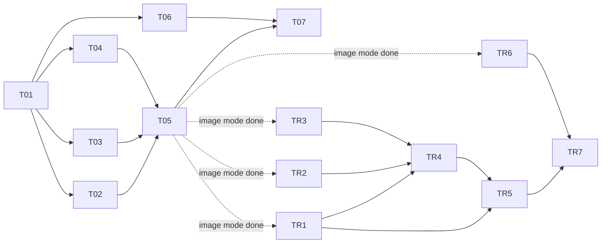

# Dashboard build — task board

Source specs: [`DASHBOARD.md`](../DASHBOARD.md) (image mode, T01–T07) and
[`RECORDING.md`](../RECORDING.md) (recording mode, TR1–TR7). Each task file in
this folder is a **self-contained brief**: an agent gets ONE task file (plus its
spec) and has everything needed — goal, frozen interface, scope, numbered
acceptance criteria. No GitHub issues; this folder is the tracker.

## Rules for agents

1. **Claim before you touch code.** Set `status: in-progress (<agent-name>)` in
   your task file's header AND in the status table below. One agent per task.
2. **Stay inside "In scope".** Every task file declares a **Public interface** —
   these are frozen contracts other tasks build against. If your task seems to
   require changing another task's interface, STOP, write the problem in your
   Log, set `status: blocked`, and surface it to Bram.
3. **Blind TDD** (when requested): run the `/blind-tdd` skill and pass the T##
   task file **as** its SPEC.md — do not author a duplicate spec (the task file
   already has the frozen Public interface + numbered ACs; two specs drift).
   The task is worked by two agents who never see each other's output in
   progress.
   - **Test agent**: writes failing tests from the ACs + Public interface
     *only*. Touches `tests/` only. Names tests after the AC they cover
     (`test_ac05_...`).
   - **Implementer agent**: makes the tests green. Touches `backend/`/`static/`
     only — may **not** edit tests. A test that seems wrong goes back to the
     test agent via the Log, not a test edit.
   - The skill drives the details: a trivial stub is written first so the tests
     go **assertion-level** red (not `ImportError`-red), the test suite itself
     gets a coverage/faithfulness review before any code is written, and the
     blind fix loop runs `pytest --tb=line` so tracebacks don't leak test
     source. Only the escape hatch may revise tests, once, from the spec alone.
4. **Done means**: every AC checked off in the task file, tests green
   (`uv run pytest` from `data-collection/dashboard/`), status set to `done`,
   dated Log entry describing what shipped.
5. **Log everything at handoff.** Append a dated one-liner to the task's `## Log`
   on claim, block, handoff, and completion. The Log is the audit trail.

Status values: `todo` · `in-progress (<agent>)` · `blocked` · `review` · `done`.
The table below is a convenience mirror — **the task file header is the source
of truth**; update both when they touch your task.

## Status

| id  | task                                              | depends on      | status | owner |
|-----|---------------------------------------------------|-----------------|--------|-------|
| T01 | [Scaffold + test fixtures](T01-scaffold.md)       | —               | done   | claude |
| T02 | [COCO-VID DatasetWriter](T02-dataset-writer.md)   | T01             | done   | claude |
| T03 | [Capture-infer loop](T03-capture-loop.md)         | T01             | done   | claude |
| T04 | [Overlay renderer](T04-overlay-render.md)         | T01             | done   | claude |
| T05 | [FastAPI layer](T05-api.md)                       | T02, T03, T04   | done   | claude |
| T06 | [Frontend (static UI)](T06-frontend.md)           | T01 (API contract only) | done | claude |
| T07 | [Hardware integration runbook](T07-integration.md)| T05, T06        | in-progress | claude |
| TR1 | [Reader/encoder split + `Latest.frame_number`](TR1-capture-recording.md) | — | done | orchestrator (blind-tdd) |
| TR2 | [H.264 encoder wrapper + probe](TR2-encoder.md)   | —               | done   | orchestrator (blind-tdd) |
| TR3 | [Shared COCO helper + `VideoEntryWriter`](TR3-video-writer.md) | —  | todo   | |
| TR4 | [Post-pass job runner](TR4-postpass.md)           | TR1 (test fakes), TR2, TR3 | todo | |
| TR5 | [Recording API + state machine](TR5-api.md)       | TR1, TR2, TR3, TR4 | todo | |
| TR6 | [Recording frontend](TR6-frontend.md)             | TR5 (endpoint contract only) | review (code done; manual pass → R4) | tr6-frontend-v2 |
| TR7 | [Recording integration + 60fps spike](TR7-integration.md) | TR5, TR6 | todo | |

## Phases / parallelism

- **Phase 0** — T01 (one agent, small).
- **Phase 1** — T02, T03, T04, T06 **in parallel** (four agents). They share no
  files: T02 = `backend/dataset_writer.py`, T03 = `backend/capture.py`,
  T04 = `backend/render.py`, T06 = `static/`. T06 builds against the endpoint
  contract in the spec's Runtime table, not against T05's code.
- **Phase 2** — T05 (one agent; wires Phase 1 modules together).
- **Phase 3** — T07 (Bram + one agent, needs Camo running on the Mac).

### Recording mode (TR1–TR7, spec `RECORDING.md`)

- **Phase R1** — TR1, TR2, TR3, TR6 **in parallel** (four agents). They share no
  files: TR1 = `backend/capture.py` (+ ONE coordinated line in `backend/app.py`
  — the `/flag` unpack; TR5 has not started, so no conflict), TR2 =
  `backend/encoder.py`, TR3 = `backend/coco.py` + `backend/video_writer.py` +
  the `dataset_writer.py` refactor, TR6 = `static/*` against TR5's frozen
  endpoint table (same pattern as T06 vs T05).
- **Phase R2** — TR4 (needs TR2 + TR3 interfaces and TR1's shared test fakes).
- **Phase R3** — TR5 (wires TR1–TR4 into the app; owns `backend/app.py` from
  here on).
- **Phase R4** — TR7 fake-camera e2e (ACs 1–6, CI-gated, no hardware), then the
  hardware half (Bram + Camo: 1080p60 spike, real end-to-end, encoder reality
  check).

## File ownership map (conflict avoidance)

| path (under `data-collection/dashboard/`) | owned by |
|---|---|
| `pyproject.toml`, `tests/conftest.py`     | T01 (later additions: flag in Log first) |
| `backend/dataset_writer.py` + its tests   | T02 → **TR3** (refactor onto `coco.py`; T02's tests stay untouched as the regression gate) |
| `backend/capture.py` + its tests          | T03 → **TR1** (recording split; T03's tests stay untouched as the regression gate) |
| `backend/render.py` + its tests           | T04 |
| `backend/app.py`, `backend/main.py` + tests | T05 → **TR5** (recording endpoints; T05's tests stay untouched as the regression gate; exception: TR1's ONE-line `/flag` unpack carve-out) |
| `scripts/validate_import.py` (shim → canonical) | T05 |
| `static/*`                                | T06 → **TR6** (recording UI; preserve existing DOM ids) |
| `scripts/find_camera.py`, runbook results | T07 |
| `backend/encoder.py` + `tests/test_encoder.py` | TR2 |
| `backend/coco.py`, `backend/video_writer.py` + their tests | TR3 |
| `backend/postpass.py` + `tests/test_postpass.py` | TR4 |
| `tests/recording_fakes.py`, `tests/test_capture_recording.py` | TR1 |
| `tests/test_recording_api.py`             | TR5 |
| `tests/test_recording_e2e.py`, `scripts/spike_fps.py` | TR7 |
