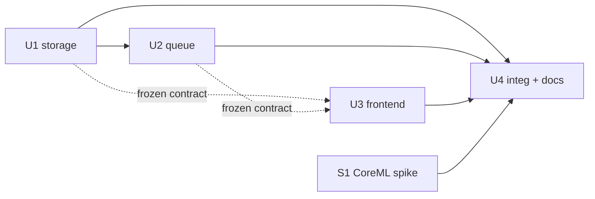

# Build plan — unified capture UI + idle-draining post-pass queue

The redesign settled in the 2026-07-09 grill (`/grill-with-docs`). Source of
truth for terms: [`../../CONTEXT.md`](../../CONTEXT.md). Source of truth for the
post-pass model reversal: [`../adr/0001-idle-draining-postpass-queue.md`](../adr/0001-idle-draining-postpass-queue.md).
Updates image mode ([`DASHBOARD.md`](../DASHBOARD.md)) and recording mode
([`RECORDING.md`](../RECORDING.md)) into one tool with a mode toggle.

Task-file conventions, status values, and the blind-TDD rules are in
[`BOARD.md`](BOARD.md). These tasks slot after T01–T07 / TR1–TR7 (all done).

> **Assumes already merged** (2026-07-09): output-path placeholder → `./captures`,
> Validate button removed from the UI (backend `/validate` kept), and a friendly
> 400 on an unwritable output path. This plan builds on that working tree.

---

## The settled design (what we're building)

**Storage** — `output_path` is a staging drop-zone; same *base name*, split by mode:
```
output_path/
├── images/<base>/            ← Dataset  (image mode: N stills accumulate)
└── videos/<base>_001/        ← Entry    (video mode: one take each; counter auto-suffix)
    videos/<base>_002/
```
Dataset and Entry are never the same folder. Changing the name = new folders.

**Controls** — mode toggle on top; **SPACE = mark, always** (still ↔ keyframe, one
relabeling button); **Record button toggles** `● Record` ↔ `■ Stop` (mouse-only,
video mode only). Toggle greyed while recording or while the queue is draining.

**Session** — free back-and-forth between modes when idle; one base name yields a
Dataset *and* Entries. Image writer state persists across toggles (resume the same
Dataset), so toggling never triggers the collision-reject.

**Post-pass** — a FIFO **queue** that drains **only when idle**, single shared
detector. Starting a recording **pauses** the in-flight job at its current frame
and resumes it when idle. A **status chip in the top bar** shows
`current done/total · N queued · ~ETA`; the blocking full-screen veil is gone.
Closing mid-queue loses nothing — each Entry is a valid partial, re-runnable via Retry.

---

## Endpoint contract (frozen — U3 builds against this)

| endpoint | change |
|---|---|
| `POST /settings {…, output_path, dataset_name}` | image target becomes `output_path/images/<dataset_name>/`. `dataset_name` = base name. Collision-reject only when that exact Dataset folder exists AND has flags on disk. |
| `POST /record/start {entry_base}` | mints `output_path/videos/<entry_base>_{NNN}/` — server scans `videos/<entry_base>_*` for the next free zero-padded counter. Returns `{entry_name}` (the resolved `<base>_NNN`). 422 on bad base, 400 on unwritable path, 409 if already recording. |
| `POST /keyframe {frame_number}` | unchanged. |
| `POST /record/stop` | finalizes MP4, **enqueues** the post-pass job, returns immediately to `idle` (does not block on processing). |
| `POST /record/discard` | unchanged (abort recording, or reject a queued/finished take → also drops it from the queue). |
| `POST /record/retry {entry_name}` | re-enqueue a failed Entry's post-pass. |
| `GET /record/status` | now `{state: idle\|recording, drain: {current: {entry_name, done, total} \| null, queued: [entry_name…], eta_seconds}, error}`. `state` is the *foreground* mode; draining is a background concern reported under `drain`. |
| `GET /status` | gains nothing new beyond the existing `recording_state`; the queue lives under `/record/status`. |

State model: foreground is `idle ↔ recording`. Draining is an **orthogonal
background worker** that runs iff `state == idle` and the queue is non-empty;
`/record/start` sets a pause flag the worker checks **between frames**.

---

## Task cut

| id  | task | owns (under `dashboard/`) | depends on | status |
|-----|------|---------------------------|------------|--------|
| U1 | Backend: storage layout + entry auto-suffix | `backend/app.py` (`/settings`, `/record/start`) + tests | — | **done** ([U1-storage.md](U1-storage.md)) |
| U2 | Backend: idle-draining post-pass queue + pause/resume + `/record/status` | `backend/postpass.py`, `backend/app.py` (state machine) + tests | U1 (shares `app.py` → sequential) | todo |
| U3 | Frontend: mode toggle, unified SPACE, Record toggle, status chip, veil removal | `static/*` + tests | U1+U2 contract frozen | todo |
| U4 | Integration + docs: mixed-session e2e, update RECORDING.md/DASHBOARD.md | `tests/test_recording_e2e.py`, docs | U1, U2, U3 | todo |
| S1 | Spike: CoreML/Neural-Engine detector acceleration | `model/` (spike only) | research agent output | todo |

**Phases**
- **P1** — U1 (backend storage), then U2 (backend queue) sequentially — both own `app.py`.
- **P2** — U3 (frontend) once the endpoint contract above is frozen (can overlap U2's impl, same as T06-vs-T05).
- **P3** — U4 integration + docs (needs U1–U3), and S1 spike in **parallel** (independent, touches `model/`).



---

## U1 — Backend storage layout + entry auto-suffix

**Goal**: image and video targets land under `output_path/images/<base>/` and
`output_path/videos/<base>_NNN/`; video Entry names auto-suffix a zero-padded counter.

**Acceptance criteria**
1. `POST /settings` with `dataset_name=X` makes the image Dataset resolve to
   `output_path/images/X/` (stills + `annotations/annotations.json` land there).
2. `POST /record/start {entry_base: X}` creates `output_path/videos/X_001/`; a
   second start with the same base creates `X_002` (scan for next free counter,
   zero-padded to 3), and the response returns the resolved `entry_name`.
3. Counter survives gaps: if `X_001` and `X_003` exist, next is `X_004` (max+1, not
   first-free) — never reuses or overwrites an existing Entry.
4. Base-name validation unchanged (single path component, no leading dot) — applied
   to the base, and the resolved `<base>_NNN` is always a valid single component.
5. Image-mode collision-reject still fires only for a genuine re-use (existing
   Dataset with flags), not for the new `images/` nesting.
6. All prior image-mode and recording tests stay green (`uv run pytest`).

## U2 — Idle-draining post-pass queue + pause/resume

**Goal**: replace the single blocking post-pass with a FIFO queue that drains only
when idle, pausable by an active recording, reporting progress for the UI.

**Acceptance criteria**
1. `POST /record/stop` enqueues the job and returns immediately; `state` goes to
   `idle` (never a blocking `processing` that rejects the next `/record/start`).
2. With the tool idle and ≥1 job queued, a background worker drains them FIFO,
   one at a time, using the shared detector.
3. `POST /record/start` while a job is mid-drain **pauses** it within one frame
   (worker checks a flag between frames), reclaims the detector for live overlay,
   and the job **resumes from its paused frame index** when the tool returns to idle.
4. A paused/interrupted/killed job leaves a valid **partial** Entry (video +
   `selected_frames.json`, no `annotations.json`) and `POST /record/retry` completes
   it; the result is identical to an uninterrupted run (idempotent — rebuild from MP4).
5. `GET /record/status` reports `{state, drain: {current:{entry_name,done,total}, queued:[…], eta_seconds}}`; `eta_seconds` = remaining frames across all jobs ÷ a running detect-fps estimate.
6. The detector is never touched by the drain worker and the live overlay at the
   same time (single-owner invariant); enforce with a lock/flag, not two instances.
7. All prior recording tests green; add concurrency tests for pause/resume and
   queue ordering (fake detector, no hardware).

## U3 — Frontend: toggle, unified SPACE, Record toggle, status chip

**Goal**: one tool, one FLAG button, a mode toggle, and the top-bar queue chip.

**Acceptance criteria**
1. A segmented **mode toggle** (📷 Image / 🎬 Video) sits at the top of the stage;
   switching it changes the control set and the SPACE behavior.
2. **SPACE marks, always**: image mode → flag a still; video mode recording → mark a
   keyframe; video mode idle → no-op with a hint ("Press Record first"). The single
   FLAG button relabels (FLAG ↔ KEYFRAME) and keeps its position.
3. The **Record button toggles** `● Record` ↔ `■ Stop`, shown only in video mode; a
   Discard button appears while recording / for a queued take.
4. The Settings name field **relabels per mode** ("Dataset name" ↔ "Recording
   session name"); its value is sent as `dataset_name` / `entry_base` accordingly.
5. The **mode toggle is greyed** while recording and while the queue is draining.
6. A **status chip in the top bar** appears whenever `drain.current` or
   `drain.queued` is non-empty, showing `done/total · N queued · ~ETA`, with Retry
   (on error) and Discard controls; the old full-screen `postpass-veil` is removed.
7. Toggling modes when idle does not re-fire `/settings` (image Dataset resumes).
8. Existing DOM ids that other code/tests rely on are preserved or their tests updated.

## U4 — Integration + docs

**Goal**: prove a full mixed session and align the specs with the built behavior.

**Acceptance criteria**
1. Fake-camera e2e: one base name → flag N stills (`images/<base>/`) → record M
   takes (`videos/<base>_001..00M/`) → queue drains all M → every Entry is a valid
   video project and the Dataset is a valid image project; assert the frame-number
   identity still holds (RECORDING.md §Gotchas).
2. e2e: start a recording mid-drain → assert the in-flight job pauses and later
   completes identically (pause/resume AC, no hardware).
3. `RECORDING.md` and `DASHBOARD.md` updated to describe the unified toggle, the
   storage layout, and the queue model; cross-link the ADR and CONTEXT.md.
4. Hardware pass (Bram + Camo): mixed session recorded, queue chip observed, one
   real post-pass completes to a video project on disk.

## S1 — CoreML detector acceleration (research done 2026-07-09)

**Goal**: move inference off plain CPU onto the M3 Max GPU/Neural Engine via the
ONNX Runtime CoreML EP. Research measured on this machine (M3 Max, onnxruntime
1.27, CoreML EP already installed; `checkpoint_best_regular.onnx` is fully static
`[1,3,768,768]` — an ideal CoreML candidate, 94% of nodes offload).

**Not a big task — it's a ~4-line change.** Two steps, do them together:

1. **CoreML EP, MLProgram, `MLComputeUnits=ALL` + on-disk cache.** Add a
   `provider_options` passthrough to `Detector.__init__` (it already takes
   `providers`, just not options), then build the detector in `backend/main.py`
   with:
   ```python
   Detector(args.weights,
       providers=["CoreMLExecutionProvider", "CPUExecutionProvider"],
       provider_options=[
           {"ModelFormat": "MLProgram", "MLComputeUnits": "ALL",
            "RequireStaticInputShapes": "1", "ModelCacheDirectory": "<persistent-dir>"},
           {}])
   ```
   - **Measured: inference 1.16 → 2.75 fps (2.4×), bit-parity output** (dets/labels
     diff ~6e-5, mask logits ~2e-3 — well below thresholds, no re-validation needed).
   - Do **not** force `CPUAndNeuralEngine` (slowest CoreML option, 1.43 fps — the
     GPU does the work). `ALL` picks correctly.
   - `ModelFormat=MLProgram` is **mandatory** — `NeuralNetwork` format throws
     `GatherElements out of range` on this graph.
   - The cache dir cuts the one-time session-build stall from **49.6 s → 9.4 s**
     on warm restarts; clear it whenever the ONNX file changes.

2. **(Secondary, measure first) Trim the Python mask postprocess.** After #1,
   inference is ~0.36 s/frame and the remaining cost is `decode_predictions`
   resizing each 192×192 mask up to 1080p per detection
   (`_rfdetr_postprocess.py:101-109`). Use `cv2.INTER_NEAREST` for the boolean
   mask (thresholded `>0` anyway) and only resize surviving masks. Add per-stage
   timers (preprocess/run/decode) and only pursue if decode is a real share.

**Realistic outcome**: end-to-end post-pass ~0.6 → ~1.3–2 fps, i.e. wall time
**~50× → ~15–25× clip length** (a 1-min clip ≈ ~20 min, not ~50). A real
improvement, but **not** enough to retire the queue/pause-resume model — that
stays load-bearing. Bigger wins (native `.mlpackage`, INT8, batching) were
investigated and rejected as low-ROI / accuracy-risky for this model; revisit
only if #1 plateaus. Benchmark scripts (`bench.py`, `parity.py`, `e2e.py`) are in
the session scratchpad.

**Not recommended** (from the research): native coremltools `.mlpackage` (no `.pt`
to re-export, same op ceiling), PyTorch MPS (no torch model in repo), INT8 quant
(regresses on CoreML), frame batching (needs a static-shape re-export).

---

## Log

- 2026-07-09 — Plan created from the grill. Design settled; CONTEXT.md + ADR-0001
  written; storage/UI/queue decisions locked. S1 research agent running.
- 2026-07-09 — **U1 done** via blind-TDD (brief: [U1-storage.md](U1-storage.md)).
  Storage split shipped: image Dataset → `images/<base>/`, video Entry →
  `videos/<base>_NNN/` with `max+1` auto-suffix; `/record/start` now takes
  `entry_base` and returns the resolved `entry_name`. Coder blind to tests;
  Opus+Codex+Fable reviewed (2 Codex blockers fixed: `/status` base-path leak,
  OSError→400 on scan). `uv run pytest` = 164 green. **P1 next: U2** (idle-draining
  post-pass queue) — shares `app.py`, so runs after U1 per the phase plan.
